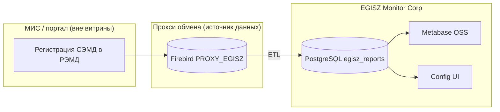
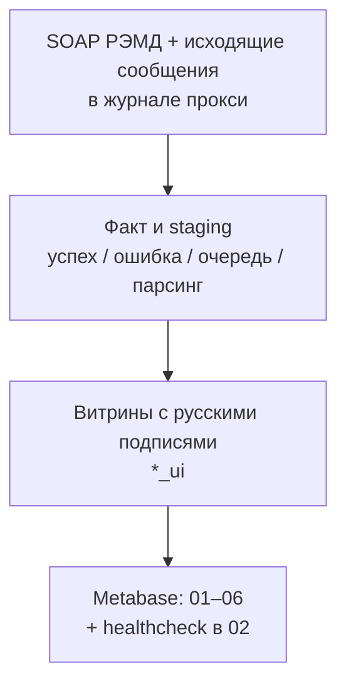

# Аналитика сервиса интеграции с РЭМД ЕГИСЗ (МИС «Инфоклиника», портал Инфоклиника.РУ)

**Дата актуализации:** 2026-05-04.

**Назначение документа:** описать, **какие данные** лежат в основе отчётности по обмену с РЭМД ЕГИСЗ, **какие отчёты и сигналы** поддерживают **управление сервисом интеграции** и **рост ключевых показателей** (доступность регистрации СЭМД, прозрачность отказов, очередь, качество канала). Техническая реализация — **кратко в конце** ([приложение A](#приложение-a-технический-стек-кратко)); развёртывание и runbook — [приложение B](#приложение-b-развёртывание-и-эксплуатация) и [README](../README.md).

**Продукт витрины:** [EGISZ Monitor Corp](../README.md) — чтение журнала прокси-БД обмена (Firebird), нормализация в PostgreSQL `egisz_reports`, дашборды **Metabase OSS**, операции синхронизации и **healthcheck API** в **Config UI**.

---

## Содержание

1. [Контекст: портал, МИС и поток РЭМД](#1-контекст-портал-мис-и-поток-ремд)
2. [Цели аналитики и вопросы управления](#2-цели-аналитики-и-вопросы-управления)
3. [Данные, на которых строится отчётность](#3-данные-на-которых-строится-отчётность)
4. [Отчётность: дашборды и ключевые витрины](#4-отчётность-дашборды-и-ключевые-витрины)
5. [Управление сервисом: сигналы, роли, реакция](#5-управление-сервисом-сигналы-роли-реакция)
6. [Бизнес-эффект и рост показателей](#6-бизнес-эффект-и-рост-показателей)
7. [Итог, риски и приоритеты](#7-итог-риски-и-приоритеты)
- [Приложение A. Технический стек (кратко)](#приложение-a-технический-стек-кратко)
- [Приложение B. Развёртывание и эксплуатация](#приложение-b-развёртывание-и-эксплуатация)

---

## 1. Контекст: портал, МИС и поток РЭМД

**Портал [Инфоклиника.РУ](https://infoclinica.ru)** и **МИС «Инфоклиника»** — среда, в которой клиники ведут учёт и отправляют СЭМД в контур ЕГИСЗ. **Интеграция с РЭМД** обеспечивает регистрацию документов и возврат результатов (в т.ч. SOAP-колбэки с итогом регистрации).

**Что попадает в аналитику этого репозитория:** не сама МИС и не портал, а **журнал и сообщения прокси-БД обмена** (типичная схема Infoclinica: Firebird `PROXY_EGISZ`) — фактически «след» интеграции: исходящие сообщения, строки журнала с телами ответов РЭМД, справочники клиник и лицензий. По ним строится **корпоративная витрина** и **дашборды для поставщика сервиса интеграции** и заказчика: объёмы, ошибки, очередь без ответа, стабильность канала.

Типовые признаки среды: транспорт в `LOGTEXT` / `REPLYTO` (`gost-…`), кодировка источника часто **WIN1251**, таблицы **`EXCHANGELOG`**, **`EGISZ_MESSAGES`**, **`JPERSONS`**, **`EGISZ_LICENSES`** — детали в [README](../README.md), [AGENTS.md](../AGENTS.md).

---

## 2. Цели аналитики и вопросы управления

| Цель | Вопросы, на которые отвечает аналитика |
| :--- | :--- |
| **Надёжность сервиса** | Жив ли канал до РЭМД? Не «застыл» ли ETL? Нет ли массовой деградации по клиникам? |
| **SLA-подобное качество** | Какая доля успешных регистраций за сутки/неделю? Где узкое место — парсер, шлюз или контент СЭМД? |
| **Очередь и ожидание** | Сколько документов ушло без callback и как долго? Растёт ли «хвост»? |
| **Прозрачность отказов РЭМД** | По каким причинам (коды/тексты) отклоняют? Какие СЭМД и клиники тянут ошибку? |
| **Рост бизнес-показателей** | Меньше простоев регистрации → выше удовлетворённость клиник; обоснование инвестиций в шаблоны, МИС, шлюз; демонстрация ценности интеграции заказчику (KPI на **02**, **05**). |

---

## 3. Данные, на которых строится отчётность

Ниже — **логика данных для бизнеса и эксплуатации** (не полный DDL; схема — `sql/001_schema.sql`, healthcheck — `sql/005_healthcheck.sql`).

| Домен данных | Смысл для сервиса | Где в витрине / отчётах |
| :--- | :--- | :--- |
| **Журнал обмена** | Каждая строка — событие контура (в т.ч. тело SOAP-колбэка РЭМД в `MSGTEXT`). Инкремент загрузки — `LOGID`. | Сырые связи при разборе; `exchangelog_log_id` на факте; ошибки парсинга с привязкой к строке журнала. |
| **Сообщения исходящие** | Отправка в РЭМД: `MSGID` (контур обмена), `EGMID` (ключ строки сообщения), `DOCUMENTID` / `REPLYTO`, время создания сообщения. | `stg_egisz_messages_journal`, факт `egisz_messages_egmid`, очередь «без ответа», карточка «прокси-БД» (лаг `EGMID`). |
| **Факт регистрации** | Нормализованный результат колбэка: статус, ошибки JSON, связь с исходящим (`relates_to_id`), клиника, тип СЭМД, даты. | `fact_egisz_transactions` → витрины `v_egisz_transactions_enriched(_ui)` — **основа оперативных и управленческих дашбордов**. |
| **Очередь без callback** | Исходящие с `DOCUMENTID`, по которым ещё нет успешного факта с тем же «локальным uid СЭМД». | `v_rpt_documents_no_response(_ui)` — дашборд **03**, блоки на **02**, **05**. |
| **Ошибки парсинга / канала** | Строка журнала не дала валидный факт (XML, нет `relatesToMessage`, слишком большой `MSGTEXT` и т.д.). | `stg_parse_errors`, `v_stg_parse_errors_by_document` — дашборд **03**, сигнал `parse_errors_burst`. |
| **Отказы контента РЭМД** | Ответ шлюза со статусом ошибки и массивом сообщений проверки. | `errors_json`, функции `egisz_friendly_*` — дашборды **04**, **01**, **05**. |
| **Справочники** | Клиника (JID, название, ИНН, OID), тип СЭМД. | `dim_clinics`, `dim_semd_types`; срезы «по клинике», «по типу документа». |
| **Снимок здоровья пайплайна** | Курсоры ETL (`LOGID`, **EGMID** снимка сообщений), пики лицензий, агрегаты по клиникам и сигналы порогов. | `etl_state`, представления `v_health_*` — API `/api/healthcheck`, дашборд **02**. |

**Важно для интерпретации:** «Обработано» в витрине привязано к времени сообщения/журнала по правилам ETL; часть карточек использует дату регистрации в XML — при презентации KPI бизнесу стоит явно называть ось времени (см. [про field filters Metabase](#field-filters-metabase) на дашборде **05**).

---

## 4. Отчётность: дашборды и ключевые витрины

### 4.1 Поток отчётности

### 4.2 Каталог дашбордов (бизнес-назначение)

Шесть JSON в `metabase_dashboards/`: **01** … **06** (архив СЭМД — отдельный дашборд **06**; **05** — управленческая сводка без полной таблицы архива). Имена карточек с префиксом **`NN ·`** — в **AGENTS.md** (раздел Metabase).

| № | Файл | Для управления сервисом и бизнеса |
|---|------|-----------------------------------|
| **01** | `01_operational.json` | Оперативный срез **и календарные тренды** по витрине; фильтры по периоду обработки, СЭМД, JID. |
| **02** | `02_service.json` | **Здоровье интеграции:** healthcheck, нагрузка по витрине, **детализация парсинга** staging (`parse_created_filter`). |
| **03** | `03_documents_no_response.json` | **KPI очереди:** без callback, возраст, топы. |
| **04** | `04_quality_and_errors.json` | **Ошибки и качество данных:** витрина (успешность, идентификаторы, полнота полей) и отказы РЭМД для диагностики. |
| **05** | `05_executive.json` | **Сводка для руководства** (витрина + очередь); разные оси даты на карточках ([field filters](#field-filters-metabase)). |
| **06** | `06_semd_archive.json` | **Архив СЭМД** (`v_rpt_semd_archive_ui`): итоги, столбчатая диаграмма по типам СЭМД, полная таблица. |

Краткие текстовые описания — [README: дашборды Metabase](../README.md#дашборды-metabase).

### 4.3 Ключевые объекты витрины (для авторов отчётов)

| Объект | Назначение |
|--------|------------|
| `v_egisz_transactions_enriched_ui` | Основная витрина с русскими колонками; **«Сводка ошибок»**, **«Ошибки JSON»**. |
| `v_rpt_documents_no_response_ui` | Очередь без ответа РЭМД. |
| `v_stg_parse_errors_by_document` | Ошибки парсинга **на документ** (`document_group_key`). |
| `v_health_*_ui` | Показатели для **02** и `/api/healthcheck`. |
| `egisz_friendly_error_item`, `egisz_friendly_errors_row` | Человекочитаемые подсказки по отказам без искажения сырого ответа. |
| `etl_state` | **`last_log_id`** — водяной знак **EXCHANGELOG.LOGID**. **`last_egmid`** и **`messages_snapshot_high_egmid`** — один смысл: максимальный **EGMID**, пройденный keyset-выгрузкой снимка **`EGISZ_MESSAGES`** в staging (плюс догрузка по **MSGID** из пакетов журнала). После успешного sync оба поля выравниваются. **Не** бизнес-время, но критично для «двинулся ли синк». |

Агрегаты по умолчанию: документы — **`COUNT(DISTINCT "Связанное сообщение")`** (`relates_to_id`); очередь — **`COUNT(DISTINCT "localUid СЭМД")`**.

### 4.4 Field filters Metabase 0.60+

Для фильтра периода на дашборде нужен **field filter** (`dimension`), не простая переменная даты — [документация Metabase](https://www.metabase.com/docs/v0.60/questions/native-editor/field-filters). На дашборде **05** один slug фильтра может маппиться на разные поля даты на разных карточках; соответствия — **`metabase_dashboards/field_filter_defaults.yaml`**. **Без алиаса** в `FROM` для `v_egisz_transactions_enriched_ui`, иначе Metabase ломает подстановку предиката.

---

## 5. Управление сервисом: сигналы, роли, реакция

### 5.1 Сценарии мониторинга

| Сценарий | Источник / смысл |
| :--- | :--- |
| Массовая авария по клинике | `v_health_by_clinic`: error-rate × объём за 24h. |
| Застой ETL или отставание прокси | `cursor_stale`; лаг курсора `etl_state.last_egmid` vs `staging_max_egmid` в `v_health_proxy_db`. |
| Очередь в РЭМД | `queue_red_24h`, возрастные корзины в `pending_age_buckets`. |
| Всплеск проблем парсинга | `parse_errors_burst` по уникальным документам за час. |
| Смена формата ответа | `unknown_high` — рост доли «неизвестно» после разборки статуса. |

Представления и пороги по умолчанию — [sql/005_healthcheck.sql](../sql/005_healthcheck.sql) (CTE `params` в `v_health_signals`). Поток: SQL → **`GET /api/healthcheck`** ([`config_app.py`](../egisz_monitor_corp/config_app.py)) → Config UI (опрос ~30 с) и дашборд **02**. При недоступности Postgres API отдаёт `ok: false` без падения HTTP — UI деградирует предсказуемо. Пример JSON — [.cursorrules](../.cursorrules).

| Сигнал | Уровень (по умолчанию) | Куда смотреть |
| :--- | :--- | :--- |
| `error_rate_high` | red | **04**, **02**, при узкой гипотезе — **01** с JID/СЭМД. |
| `unknown_high` | yellow | **01**, **02**; сравнение эталонного XML с `MSGTEXT`. |
| `parse_errors_burst` | red | **02**, `stg_parse_errors`. |
| `queue_red_24h` | red | **03**, **02**; эскалация шлюза / выгрузки. |
| `cursor_stale` | red | Логи conf-ui, Airflow, сеть к Firebird. |

### 5.2 Роли и типовые действия

| Роль | Отчёты и инструменты | Решения |
| :--- | :--- | :--- |
| **Аналитик интеграции** | **01**, **02**, **03**, **04** | Изоляция аномалий по клинике/СЭМД, передача в L2. |
| **L2-поддержка** | **02**, **03**, очередь, `stg_parse_errors` | Ретраи, эскалация администратору прокси / РЭМД. |
| **Администратор интеграции** | Config UI, **02**, CronJob / Airflow | Окно `sync_window_days`, курсоры, пороги healthcheck. |
| **Руководитель сервиса / заказчика** | **02**, **05**, **04** | KPI, очередь, доля ошибок, обоснование бюджета доработок. |

### 5.3 Рецепт реакции (кратко)

1. **Config UI → Healthcheck:** топ-3 клиники и список сигналов.
2. **`cursor_stale`:** логи `deploy/conf-ui`, история Airflow.
3. **`parse_errors_burst`:** дашборд **02** и выборка из `stg_parse_errors`.
4. **`error_rate_high`:** **04** и **02**; деталь — **01**.
5. **`queue_red_24h`:** **03** и корзины возраста на **02**.

---

## 6. Бизнес-эффект и рост показателей

**Связка «сервис → бизнес»:** стабильная регистрация СЭМД в РЭМД напрямую влияет на операционку клиник (МИС, портал) и на доверие к интеграции как к продукту. Аналитика даёт:

- **Сокращение времени простоя:** раннее обнаружение очереди (**03**, **02**) и канала (**02**, сигналы).
- **Целевые инвестиции:** **04** показывает, *что* именно отклоняет РЭМД (шаблон, справочник, валидация) — приоритизация бэклога МИС и интеграции.
- **Доказательная база для заказчика:** **05** и **02** — слайды для совещаний: объём, успешность, «красные зоны» без доступа к сырой БД клиники.
- **Масштабирование:** **01**/**04** — тренды и регресс качества при росте числа клиник и типов СЭМД.

**Пробелы для дальнейшего роста value:** нет встроенного слоя «контракт / SLA по клинике»; **05** смешивает оси времени — для управленческой презентации нужен короткий гайд «как читать» или опора на **02** первым; рассылки алертов — через Metabase OSS или внешний мониторинг поверх тех же SQL (см. [раздел 7](#7-итог-риски-и-приоритеты)).

**Практика отдела интеграции:** держать в паритете фильтры **01** и **03** по СЭМД/JID при сравнении потока и очереди; при изменении `005_healthcheck.sql` сверять **02** и `/api/healthcheck`; **06** (архив СЭМД) — для точечных расследований и выгрузок.

---

## 7. Итог, риски и приоритеты

| Категория | Готовность | Куда двигаться |
| :--- | :--- | :--- |
| Данные и витрина | Высокая | Расширять `egisz_friendly_*` под новые типы отказов РЭМД. |
| Операционный контроль | Высокая | Алёртинг по `v_health_signals` (не только ручной просмотр **02**). |
| ETL | Высокая | Метрики Prometheus, `/healthz` без БД для liveness. |
| Масштаб хранения | Средняя | Партиции `fact_*` при горизонте >1–2 лет. |
| Зрелость поставки отчётов | Зрелый | Bump образа Metabase при любом изменении JSON/`setup-dashboards.sh`. |

**Backlog:** метрики Prometheus / Grafana или Datadog; подписки на сигналы; партиционирование факта; несколько `pipeline_name` при нескольких прокси-БД; OIDC перед Config UI в проде.

---

## Приложение A. Технический стек (кратко)

| Слой | Реализация |
| :--- | :--- |
| **Источник** | Firebird: `EXCHANGELOG`, `EGISZ_MESSAGES`, `JPERSONS`, `EGISZ_LICENSES` (прокси обмена; типично WIN1251). |
| **Интеграция данных** | Python 3: пакет `egisz_monitor_corp` — `etl.run_sync` (справочники; чередование пакетов **EXCHANGELOG** и keyset-снимка **EGISZ_MESSAGES** по **EGMID**; догрузка сообщений по **MSGID** при необходимости; парсер SOAP; UPSERT). |
| **Хранилище витрины** | PostgreSQL, БД `egisz_reports`: факт `fact_egisz_transactions`, staging, измерения, представления `v_*`, SQL healthcheck. |
| **Парсинг** | `parser.EgiszMonitorParser` — XML из `MSGTEXT`, `local-name`, связь с исходящим по `relatesToMessage`. |
| **Синхронизация и API** | Flask Config UI: `POST /api/sync/start` (single-flight), `/api/healthcheck`; advisory lock в PG против гонки CronJob и UI. |
| **Расписание** | Kubernetes `CronJob` (`k8s/etl-cron.yaml`), опционально Airflow DAG `airflow/dags/egisz_monitor_etl_dag.py`. |
| **BI** | Metabase OSS; дашборды из `metabase_dashboards/*.json`, провижининг в образе `metabase/Dockerfile` + `setup-dashboards.sh`. |

**Курсоры ETL (для отладки):** `etl_state.last_log_id` — журнал `EXCHANGELOG.LOGID` (водяной знак после пакетов). Снимок **`EGISZ_MESSAGES` → `stg_egisz_messages_journal`:** keyset **`EGMID > after_egmid`** (старт с **`messages_snapshot_high_egmid`**); после успешного run **`last_egmid`** и **`messages_snapshot_high_egmid`** записываются в одно и то же значение. Отбор в Firebird: непустой **`DOCUMENTID`**, опционально окно **`CREATEDATE`** при `sync_window_days > 0`; при `sync_window_days ≤ 0` — без фильтра по дате, только за курсором. Дополнительно из пакетов журнала догружаются строки по **`MSGID`**, если их ещё нет в staging. Outbound — полная перезапись staging теми же предикатами **`DOCUMENTID`/дата** ([`sql_util`](../egisz_monitor_corp/sql_util.py)). В healthcheck **`etl_cursor_egmid`** = **`etl_state.last_egmid`** для сравнения со staging.

---

## Приложение B. Развёртывание и эксплуатация

**Основной runbook:** [README](../README.md), сценарии **`start.ps1`**, манифесты **`k8s/`**, порядок DDL — [`sql/schema_apply_order.txt`](../sql/schema_apply_order.txt).

| Задача | Команда (из корня репозитория) |
|--------|-------------------------------|
| Обычный цикл без сброса Metabase app DB | `.\start.ps1` (`apply`) |
| Первый подъём / сброс БД приложения Metabase | `.\start.ps1 -Action deploy` |
| Полный сброс namespace и данных витрины | `.\start.ps1 -Action reset-deploy` |
| Только пересборка conf-ui | `.\start.ps1 -Action restart-web` |
| Смена JSON дашбордов / образа Metabase | `.\start.ps1 -Action restart-metabase` (и bump тега образа, напр. `k8s-v23` в `k8s/metabase.yaml`) |
| Проверка витрины и карточек в поде | `.\start.ps1 -Action verify` |

**Metabase:** Service `metabase`, порт **3000**; при Pending LoadBalancer — `kubectl -n egisz-monitor port-forward svc/metabase 3000:3000`. После `apply` — rollout Metabase + conf-ui, ожидание readiness **2–6+ мин** нормально. Кириллица: `firebird.charset` в YAML (часто WIN1251), контейнер Metabase — `C.UTF-8`. Главная `/` Metabase и Site URL — см. [README](../README.md) и документацию Metabase; типичная ошибка — разные origin `127.0.0.1` и `localhost`.

**Namespace:** `egisz-monitor`. Детали манифестов, Postgres (ClusterIP), CronJob, Secret админа Metabase — в прежних материалах репозитория (`k8s/conf-ui.yaml`, `k8s/metabase.yaml`, `k8s/etl-cron.yaml`) при необходимости глубокого аудита инфраструктуры.

---

*(Исторические номера **07–09** и отдельные «03 парсинг / 05 тренды» сведены к шести дашбордам **01–06**; архив СЭМД снова вынесен в **06**; см. каталог в §4.2.)*
