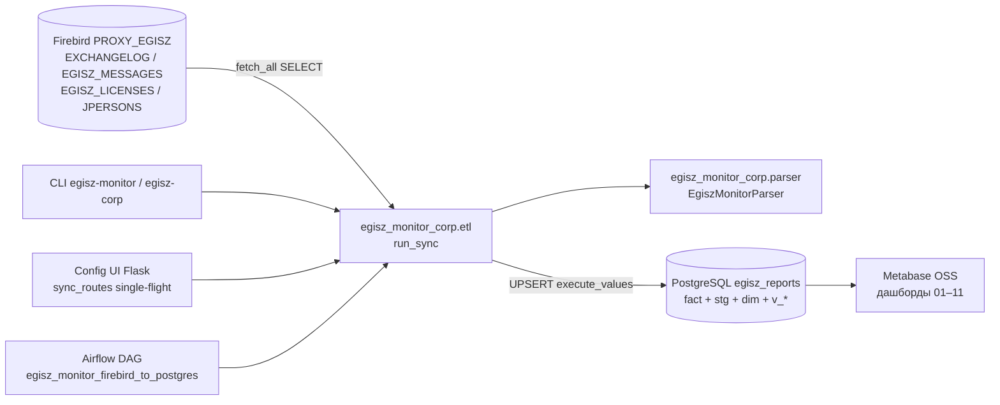
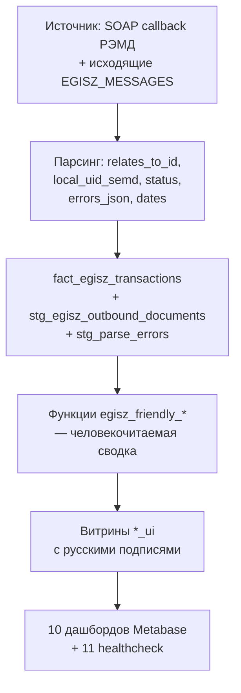
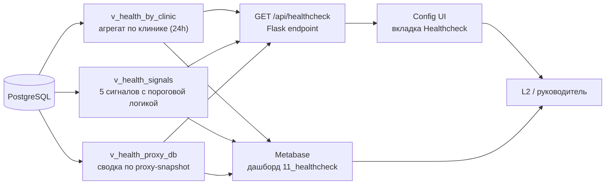

# Аудит сервиса интеграции EGISZ Monitor Corp

Дата: 2026-04-30. Базовая ветка: `master`. Артефакт сопровождает [README.md](../README.md), [AGENTS.md](../AGENTS.md) и [.cursorrules](../.cursorrules); в этих файлах — ссылки на разделы аудита.

Аудит сосредоточен на **сервисе интеграции МИС ↔ ЕГИСЗ/РЭМД** (ETL + витрина + BI), а не на смежных продуктах. Доменные термины (СЭМД, `relatesToMessage`, `localUid`, `JID`, `gost-host`) определены в `.cursorrules` и здесь не дублируются.

---

## 1. Техническая реализация и масштабируемость

### 1.1 Слои и точки входа



| Точка входа | Файл | Реентерабельность |
| :--- | :--- | :--- |
| `egisz-monitor sync` | [egisz_monitor_corp/cli.py](../egisz_monitor_corp/cli.py) | Каждый запуск — отдельный процесс. |
| `POST /api/sync/start` | [egisz_monitor_corp/sync_routes.py](../egisz_monitor_corp/sync_routes.py) | **Single-flight** через `_state_lock` + `threading.Thread`; повторный запуск во время активного синка отклоняется. |
| Kubernetes `CronJob egisz-monitor-sync` | [k8s/etl-cron.yaml](../k8s/etl-cron.yaml) | `*/15 * * * *`, тот же образ что conf-ui, `concurrencyPolicy: Forbid`, `activeDeadlineSeconds: 1800`. |
| Airflow DAG | `airflow/dags/egisz_monitor_etl_dag.py` | Полагается на расписание Airflow и инкрементный курсор `etl_state.last_log_id`. |

**Защита от гонки CronJob ↔ UI-кнопки** реализована **session-level** advisory lock'ом в Postgres: `pg_try_advisory_lock(hash(pipeline_name))` берётся в начале `run_sync` (см. [`pg_warehouse.try_acquire_pipeline_lock`](../egisz_monitor_corp/pg_warehouse.py)). Если другой процесс уже владеет локом — `run_sync` бросает `PipelineLockBusyError`, CLI выходит с кодом 75 (`sync_skipped`), UI показывает «параллельный sync уже идёт». Lock автоматически освобождается при разрыве соединения, поэтому крэш воркера не оставляет «навечно занято» — ручной reset не нужен.

### 1.2 Курсор и инкрементальность

- Водяной знак — поле `EXCHANGELOG.LOGID` в Firebird; хранится в [`etl_state.last_log_id`](../sql/002_etl_state.sql) по имени пайплайна (`firebird_exchangelog`).
- Полная пагинация — `SELECT FIRST {batch_size} src.* FROM (… AND e.LOGID > {last_id} ORDER BY e.LOGID) src` (см. [`sql_util.paginated_exchangelog_sql`](../egisz_monitor_corp/sql_util.py)). Это устойчивая реализация курсора без `OFFSET`, не разрушающаяся при росте `EXCHANGELOG`.
- `full_scan: true` сбрасывает курсор в 0, но окно `LOGDATE` всё равно ограничивает выборку (`DATEADD(-sync_window_days DAY TO CURRENT_TIMESTAMP)`), что предотвращает «случайный» большой пересчёт.
- COUNT в `exchangelog_count_window_after_cursor` сделан **без скалярных подзапросов к `EGISZ_LICENSES`** — он совпадает с rowset основного запроса, но не выполняет N×lookups.

### 1.3 Пакетирование и ввод/вывод

- `batch_size` в YAML управляет **только** размером страницы; календарное окно — `sync_window_days`.
- Внутри страницы:
  - `fact_buffer` собирает успешные записи и идёт UPSERT через [`upsert_facts_batch`](../egisz_monitor_corp/pg_warehouse.py) с `psycopg2.extras.execute_values` и шаблоном c явным `::jsonb` на `errors_json` (предотвращает CardinalityViolation: внутри одного statement дедуп по `relates_to_id`).
  - `staging_buffer` для `stg_parse_errors` сбрасывается каждые 200 записей или в конце страницы.
- После каждой страницы курсор `last_log_id` сдвигается до `MAX(LOGID)` и коммитится **до** обработки следующей страницы — это даёт корректное возобновление при сбое.

### 1.4 Кэш справочников

- В `run_sync` загружаются:
  - `EGISZ_LICENSES` (только `JID IS NOT NULL`) с join к `JPERSONS` по `JID`;
  - `JPERSONS` отдельно по `JID IS NOT NULL`.
- В памяти процесса строятся словари `mo_uid_to_jid_from_egisz_licenses`, `jpersons_by_jid`, `jname_by_jid`, что даёт `O(1)` lookups в горячем цикле и исключает повторные SELECT-ы. Память — типично десятки тысяч строк × ~5 атрибутов = единицы МБ; не критично.
- Источники определения клиники проходят 4-уровневую цепочку (см. [parser.py](../egisz_monitor_corp/parser.py) `resolve_clinic`). Это даёт устойчивость к изменению схемы транспорта (LOGTEXT vs MSGTEXT vs REPLYTO).

### 1.5 Парсер

- XML только из `EXCHANGELOG.MSGTEXT`; перед `ET.fromstring` режется префикс до `<?xml|<soap:|<s:Envelope`. При ошибке оборачивается в `<root>…</root>` (двухуровневый fallback).
- Тег идентифицируется по `local-name` (Clark notation) — устойчиво к смене namespace/prefix у поставщика.
- Если `relatesToMessage` отсутствует, факт не строится — в `stg_parse_errors` пишется `MISSING_RELATES_TO` или `XML_BROKEN`. Поведение чётко зафиксировано в [test_parser.py](../tests/test_parser.py).
- Тестовые клиники (содержащие `test`/`тест` в `jname`) фильтруются на стороне ETL и в outbound staging — ожидаемое поведение для защиты статистики.

### 1.6 Сильные стороны

| Аспект | Оценка |
| :--- | :--- |
| Тесты парсера | 12 тестов, покрытие edge-cases (gost host в MSGTEXT vs LOGTEXT vs REPLYTO, registration_date_time, missing relates, errors array). |
| Идемпотентность | UPSERT по `relates_to_id` + дедуп в одном statement; курсор `last_log_id` коммитится постранично. |
| Прозрачность UI | Прогресс по фазам (`counting`, `messages_incremental`, `exchangelog_export`, `exchangelog_parse`, `parsing`, `page_done`, `exchangelog_done`, `outbound_*`) с детализацией loaded/total. |
| Корректность кодировок | `WIN1251` по умолчанию для Firebird, `UTF8` `client_encoding` для PG, `LANG=C.UTF-8` в подах Metabase и conf-ui — устраняет «????» в кириллице. |
| Безопасность доступа | Firebird — read-only credentials; PG — `egisz/egisz` локально, секрет в k8s; Metabase admin secret отдельный YAML; пароли при сохранении в YAML не очищаются, если поле пустое. |

### 1.7 Узкие места и риски

| Проблема | Воздействие | Рекомендация |
| :--- | :--- | :--- |
| **`run_sync` — длинная функция** (~390 строк) | Сложно покрыть тестами и развивать | Выделить под-фазы в чистые функции (`_load_enrichment`, `_count_exchangelog`, `_process_page`, `_refresh_outbound`); вернуть `EtlRunStats`. |
| **Outbound staging — `DELETE …; INSERT execute_values`** | Под нагрузкой даёт холодный `seq scan` для отчёта; пиковое окно блокировки таблицы | Добавить транзакцию `BEGIN/COMMIT` явно (сейчас autocommit=False, но порядок операций тонкий) — уже соблюдается; рассмотреть `TRUNCATE … RESTART IDENTITY` либо staging swap (две таблицы). |
| **Нет таймаутов на Firebird/PG** | Зависший SELECT держит UI «выполняется» бесконечно | В `connect_pg` поставить `options="-c search_path=… -c statement_timeout=300000"` (5 мин); в `firebird-driver.connect` — параметр `timeout` или сторожевой таймер на потоке. |
| **`fact_egisz_transactions` без партиционирования** | При росте за горизонт > 1–2 года агрегаты по `processed_at` станут дорогими | Добавлен индекс на `processed_at` в [sql/005_healthcheck.sql](../sql/005_healthcheck.sql); при > 50 млн строк рассмотреть `pg_partman` по месяцам. |
| **Полный `apply_sql_files` каждый прогон** | DDL re-runs на каждом sync; «лишняя» работа | DDL идемпотентны, но можно вызывать только раз (по флагу `apply_sql_files_done` в `etl_state` или `IF EXISTS`-проверкой). |
| **Отсутствие `/livez`/`/readyz` на Config UI** | Kubernetes использует `GET /` для readinessProbe — затрагивает базу | Завести лёгкий `GET /healthz` без обращения к Postgres. |
| **Метрики/логирование** | Только текст в `_state["message"]`; нет Prometheus | Добавить `prometheus-client` для `egisz_sync_runs_total`, `egisz_sync_duration_seconds`, `egisz_sync_errors_total` в горизонте 1 спринта. |

### 1.8 Масштабируемость

- **Горизонтальная**: `run_sync` детерминирован и инкрементальный, его можно запускать в нескольких пайплайнах с разными `pipeline_name` (например, по диапазонам `JID` или копиям прокси-БД). Текущий код это поддерживает.
- **Вертикальная**: пакеты `batch_size: 500` — баланс между сетевым round-trip и памятью; на крупных баз стандартно поднимают до 1000–2000 при достаточной памяти у воркера.
- **Multi-tenant**: одна `etl_state` строка на пайплайн → можно запустить 2–3 параллельных синка, не пересекая курсоры. Витрина общая (одна `fact_egisz_transactions`), что упрощает отчётность.

### 1.9 Интегрируемость в корпоративные системы

- **Airflow**: DAG читает конфиг по переменным `egisz_monitor_project_root` / `egisz_monitor_config_path`; задача `test_connections` отделена от `monitor_sync`. Вызывает `run_sync` напрямую без shell — устойчиво к изменениям CLI.
- **Kubernetes**: namespace `egisz-monitor`, отдельные Job (schema-init, airflow-metadata-init), отдельные Secret (`postgres-credentials`, `metabase-admin`, `egisz-monitor-conf-ui-config`). Init-container для Config UI копирует Secret в emptyDir, чтобы Flask мог писать YAML — хороший паттерн для read-only K8s Secret.
- **Локальный dev**: `start.ps1` создаёт kind cluster при необходимости, грузит образы, делает `kubectl apply` и port-forward, поддерживает `restart-metabase`/`restart-conf-ui`/`restart-web` — даёт быстрый цикл итераций.
- **CLI пакет**: `egisz-corp` и `egisz-monitor` зарегистрированы в `pyproject.toml`, оба ведут в `egisz_monitor_corp.cli`. Это позволяет включить пакет в любой корпоративный стек как `pip install -e .` и не зависеть от Docker-образа.
- **Конфиг**: YAML с поддержкой `EGISZ_MONITOR_CONFIG`, `EGISZ_MONITOR_POSTGRES_*` ENV-overrides и Kubernetes Secret-mount (с обработкой ротируемого пути `..YYYY_MM_DD_*`).

### 1.10 Рекомендации по интеграции в корпоративный стек

1. **Метаданные пайплайнов**: завести Airflow Variable / k8s ConfigMap с массивом пайплайнов (имя → конфиг) и шаблонизировать DAG, чтобы добавить вторую интеграцию из той же кодовой базы.
2. **OIDC / SSO** на Config UI: сейчас доступ только сетевой. Для прода — поставить ingress + auth proxy (oauth2-proxy / Keycloak).
3. **Прометеус**: добавить `/metrics` в Flask, экспортировать счётчики и гистограмму длительности синка.
4. **Datadog/ELK интеграция**: структурированный лог (`json` formatter) уже близко к идеалу — ожидается переход с `print` на `logging.getLogger(...)` с JSON-форматтером.
5. **Алёрты**: на основе раздела 3 («Healthcheck») — Slack/Email при `error_rate > 10%` за 1 час или `pending_red > N` (см. `v_health_signals`).

---

## 2. Бизнес-логика и применение данных

### 2.1 Поток ценности



### 2.2 Покрытие бизнес-вопросов

| Бизнес-вопрос | Что ответ | Где смотреть |
| :--- | :--- | :--- |
| Сколько документов мы передали и сколько прошло успешно? | `Статус` × `processed_at`, success rate. | **01 Оперативный**, **05 Тренды**, **09 Управленческий**. |
| Какие клиники чаще всего получают отказ? | error-rate по клинике с порогом. | **06 Качество данных**, **10 Топы ошибок**, **11 Healthcheck** (новый). |
| По каким причинам РЭМД отклоняет регистрацию? | Топ `egisz_friendly_error_item` (Schematron, ГИП и т.д.). | **07 Глубокий анализ**, **10 Топы ошибок**. |
| Сколько документов «зависло» без ответа и насколько давно? | `v_rpt_documents_no_response_ui` + age-buckets. | **04 Документы без ответа**, **08 Агрегация ожидающих**. |
| Растёт ли доля `unknown` (нестандартный ответ)? | Доля `unknown` в трендах. | **05 Тренды**, **11 Healthcheck**. |
| Падает ли парсинг (битый XML, нет relates)? | Объём `stg_parse_errors`. | **03 Ошибки и разбор**, **11 Healthcheck**. |
| Двинулся ли курсор / прокси-БД жива? | `etl_state.last_log_id` + peaks Firebird. | Config UI snapshot, **11 Healthcheck**. |

### 2.3 Применение для целевых ролей

| Роль | Что использует | Как принимает решение |
| :--- | :--- | :--- |
| Аналитик интеграции | Дашборды 01, 03, 04, 07 | Найти клиники/СЭМД с аномалиями, передать в L2-поддержку. |
| L2-поддержка | Дашборд 03 + `stg_parse_errors`, `v_rpt_documents_no_response_ui` | Ретраить, эскалировать на администратора прокси / провайдера РЭМД. |
| Администратор интеграции | Config UI + дашборд 11 + Airflow DAG | Запускать sync, корректировать `sync_window_days`, реагировать на сигналы healthcheck. |
| Руководитель сервиса | Дашборды 09 и 11 | Контролировать KPI: объём, % ошибок за день, очередь, число «red» клиник. |

### 2.4 Сильные стороны бизнес-логики

- **Строгая проверка причинности**: факт строится только при наличии `relates_to_id` — нет ложных «успехов» из произвольно проходящих SOAP-сообщений.
- **Двухуровневая ошибочность**: `stg_parse_errors` (канал/ETL) ≠ `errors_json` (отказ РЭМД); это позволяет адресно искать причину.
- **Человекочитаемая сводка**: функции `egisz_friendly_error_item` / `egisz_friendly_errors_row` сжимают Schematron-каскады в осмысленные подсказки (адрес пациента, ДУЛ, ГИП), не заменяя сырой JSON.
- **Очередь без ответа**: `v_rpt_documents_no_response` — `NOT EXISTS` против факта по `local_uid_semd` — корректно отражает реальные «зависшие» документы.
- **Автоматизация подписей колонок**: `dim_column_display_labels` + `*_ui` views — единая русская терминология в Metabase без копирования в каждом запросе.

### 2.5 Узкие места бизнес-применения

| Проблема | Воздействие | Рекомендация |
| :--- | :--- | :--- |
| Нет порогов / эталонов | KPI читаются субъективно; нет «зелёный/жёлтый/красный» | Внедрено в [v_health_signals](../sql/005_healthcheck.sql); пороги настраиваются комментарием. |
| Зависимость от `processed_at` (~ETL load time) при отсутствии MSG_CREATEDATE | Тренды могут «прыгать» в момент догонки после простоя | На дашбордах 05, 09 уже добавлен fallback на `registration_date`; в новом 11 — отдельно `last_seen_at`. |
| Тестовые клиники фильтруются по подстроке | Если клиника называется "Тестов и сын" — выпадет из статистики | Документировано в `.cursorrules`; альтернатива — флаг `is_test` в `dim_clinics`. |
| Дашборды только в Metabase | Нет «почтовой» рассылки | Metabase OSS поддерживает email/Slack subscriptions; настройка вне репо. |

---

## 3. Healthcheck сервиса интеграции

### 3.1 Сценарии

| Сценарий | Триггер | Источник |
| :--- | :--- | :--- |
| Массовая авария в клинике | Резкий рост `error` или 100% `error` за 1 час | `v_health_by_clinic.error_rate_24h` × объём `facts_24h`. |
| Сбой прокси-БД (Firebird) | `etl_state.last_log_id` не растёт; peaks Firebird растут | `v_health_signals` сигнал `cursor_stale` (≥ 6 часов без движения). |
| Сбой шлюза РЭМД | Очередь без ответа растёт линейно по часу | `v_health_proxy_db.pending_age_buckets`. |
| Сбой парсера | `stg_parse_errors` растёт быстрее `facts_upserted` | `v_health_signals.parse_errors_burst`. |
| Версия XML изменилась у поставщика | `unknown` rate растёт без роста объёма | `v_health_signals.unknown_high`. |

### 3.2 Архитектура healthcheck



### 3.3 Сигналы и пороги (по умолчанию)

| Сигнал | Триггер | Уровень | Что делать |
| :--- | :--- | :--- | :--- |
| `error_rate_high` | error-rate за 24h > 10% при facts_24h > 50 | red | Открыть дашборд **10**, отсортировать клиники по `error_rate_24h`. |
| `unknown_high` | unknown за 24h > 5% от facts_24h | yellow | Сравнить версию XML в `MSGTEXT` с эталонами; обновить парсер. |
| `parse_errors_burst` | parse_errors за 1h > 10 | red | Пересмотреть последние записи `stg_parse_errors` (поле `log_excerpt`). |
| `queue_red_24h` | в очереди > 24h > 50 документов | red | Проверить шлюз РЭМД, выгрузку в Firebird. |
| `cursor_stale` | `etl_state.updated_at` старше NOW() − 6h | red | Проверить Airflow DAG / сетевой доступ к Firebird. |

Пороги — в [sql/005_healthcheck.sql](../sql/005_healthcheck.sql); править там же при необходимости (требуется `apply-schema`).

### 3.4 Массовая проверка по клиникам

- `v_health_by_clinic` — одна строка на клинику, агрегаты за 24 ч + текущая очередь, `error_rate_24h`, `unknown_24h`, `last_seen_at`.
- В дашборде **11_healthcheck** карточка «Heatmap клиники × дни (error rate)» рендерит pivot за последние 14 дней.
- В Config UI вкладка Healthcheck показывает топ-3 проблемные клиники + общий список сигналов (приоритет по уровню).

### 3.5 Healthcheck прокси-БД

- `v_health_proxy_db` агрегирует `stg_egisz_outbound_documents`: общее число строк, рост по часам, доля без `EGMID`, доля без распознанного `JID`.
- Связка с peaks Firebird (`MAX(EGMID)`, `MAX(EGISZ_LICENSES.MODIFYDATE)`) идёт через [`fetch_firebird_source_peaks`](../egisz_monitor_corp/fb_client.py); расхождение `proxy_max_egmid` vs `staging_max_egmid` подсвечивает «застой» приёма из источника.

### 3.6 Эндпоинт `GET /api/healthcheck`

Контракт ответа (см. [`config_app.py`](../egisz_monitor_corp/config_app.py)):

```json
{
  "ok": true,
  "generated_at": "2026-04-30T10:15:00+00:00",
  "signals": [
    {"code": "error_rate_high", "level": "red", "value": 14.5, "since": "2026-04-30T08:00:00+00:00"}
  ],
  "by_clinic_top": [
    {"jid": 1234, "clinic_name": "...", "facts_24h": 312, "error_rate_24h": 18.5, "pending_now": 7}
  ],
  "proxy_db": {
    "stg_outbound_total": 4521,
    "stg_without_egmid": 0,
    "fb_max_egmid": 29261989,
    "staging_max_egmid": 29261980,
    "egmid_lag": 9
  }
}
```

При недоступности Postgres эндпоинт возвращает `{"ok": false, "error": "..."}` со статусом 200 — UI красит карточку оранжевым, Metabase читает витрины напрямую и не зависит от Flask.

### 3.7 Готовый рецепт реакции

1. Открыть **Config UI → Healthcheck**: топ-3 проблемные клиники + список сигналов с уровнем.
2. Если сигнал `cursor_stale` — `kubectl -n egisz-monitor logs deploy/conf-ui --tail=100`, проверить Airflow run history.
3. Если сигнал `parse_errors_burst` — `SELECT * FROM stg_parse_errors ORDER BY id DESC LIMIT 50;` в PG.
4. Если сигнал `error_rate_high` — открыть дашборд **10 Топы ошибок** и фильтровать по «Наименование клиники».
5. Если сигнал `queue_red_24h` — открыть дашборд **08 Агрегация ожидающих**, обратиться к L2 шлюза.

---

## 4. Итог и приоритеты

| Категория | Готовность | Куда двигаться |
| :--- | :--- | :--- |
| ETL и инкремент | Высокая | Сторожевой таймер, метрики Prometheus. |
| Бизнес-витрина | Высокая | Расширить список причин в `egisz_friendly_*` по мере новых типов отказов. |
| Healthcheck | Внедряется в этой ветке (см. SQL/UI/MB) | Алёрты в Slack/Email через subscriptions Metabase. |
| Документация | Покрыта (README, AGENTS, .cursorrules, KUBERNETES_LOCAL, METABASE, SYNC_DIAGNOSTICS, INTEGRATION_AUDIT) | Поддерживать актуальность при изменениях. |
| Тесты | Парсер и SQL покрыты; добавляются `test_pg_warehouse.py` и `test_config_app.py` | Расширить интеграционные тесты на `run_sync` с моком PG/FB. |

Дальнейшие шаги в backlog:

1. Метрики Prometheus + Grafana / Datadog.
2. Алёртинг через Metabase subscriptions или отдельный alertmanager.
3. Партиционирование `fact_egisz_transactions` после ~50 млн строк.
4. Параллельные пайплайны (`pipeline_name` per shard) — сейчас архитектура это поддерживает.
